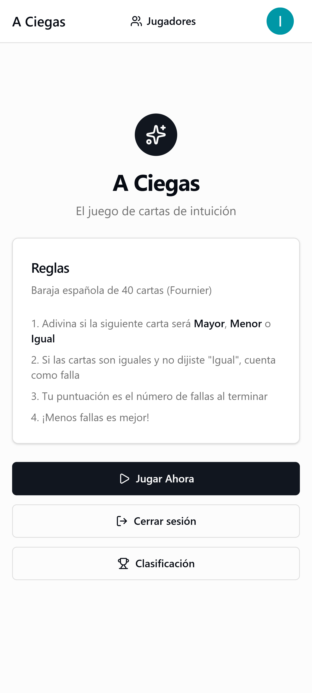
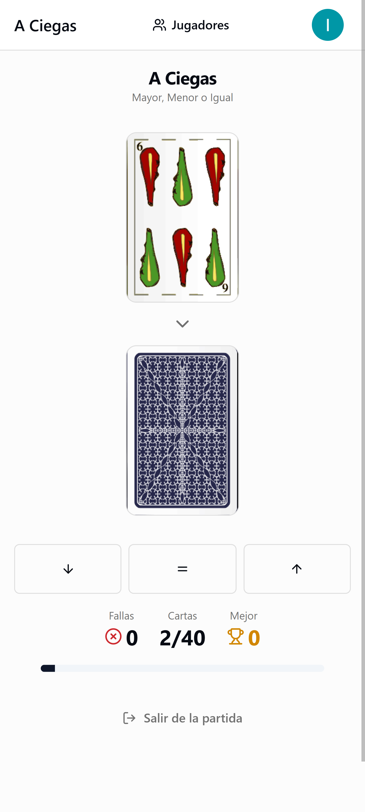
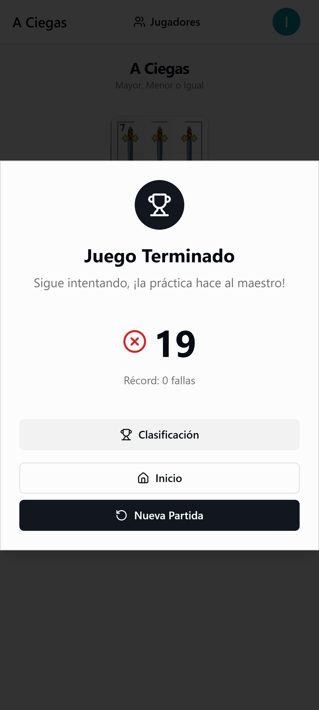
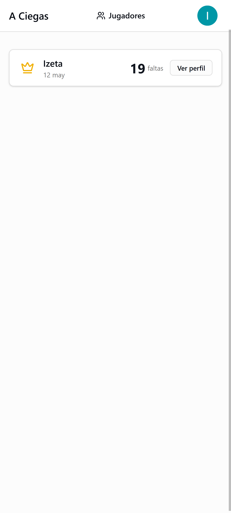
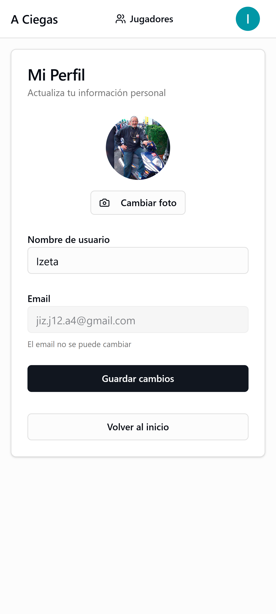

# A Ciegas

---

> **Este es un proyecto de aprendizaje** - Creado en un par de mañanas para aprender **vibecoding** con [opencode](https://opencode.ai). No es un proyecto serio ni profesional, solo un experimento personal para probar herramientas de IA en el desarrollo de software.

---

<div align="center">

[](https://nextjs.org)
[](https://www.typescriptlang.org)
[](https://tailwindcss.com)
[](https://supabase.com)
[](LICENSE)

Un juego de cartas de tipo "Mayor o Menor" con el tradicional mazo de 40 cartas.

</div>

## Descripcion

**A Ciegas** es un juego de intuicion y riesgo donde los jugadores deben predecir si la siguiente carta sera mayor, menor o igual a la carta actual. El objetivo es completar las 40 cartas del mazo con el menor numero de fallos posible.

El juego utiliza el autentico mazo de cartas (mazo de 40 cartas Fournier), con los cuatro palos tradicionales: Oros, Copas, Espadas y Bastos.

## Caracteristicas

- **Jugabilidad clsica**: Mazo completo de 40 cartas (As a 7, Sota, Caballo, Rey)
- **Tres modos de apuesta**: Mayor, Menor o Igual
- **Autenticacion**: Inicio de sesion con Google OAuth
- **Persistencia de juego**: Guarda tu progreso en Supabase y continua cuando quieras
- **Tabla de posiciones**: Compite con otros jugadores y consulta los mejores puntuajes
- **Lista de jugadores**: Explora perfiles de otros jugadores y su historial de partidas
- **Diseno mobile-first**: Optimizado para dispositivos moviles
- **Animaciones fluidas**: Experiencia visual atractiva con Framer Motion
- **Diseño elegante**: Interfaz moderna con shadcn/ui y Tailwind CSS

## Capturas de Pantalla

| Pantalla de Inicio | Juego en Progreso | Fin de Partida |
|:------------------:|:-----------------:|:---------------:|
|  |  |  |

| Tabla de Posiciones | Perfil de Jugador |
|:-------------------:|:-----------------:|
|  |  |

## Tecnologias

| Categoria | Tecnologia |
|-----------|------------|
| Framework | Next.js 16 (App Router) |
| Lenguaje | TypeScript |
| Estilos | Tailwind CSS v4 |
| Componentes | shadcn/ui |
| Animaciones | Framer Motion |
| Backend | Supabase (PostgreSQL) |
| Autenticacion | Google OAuth |
| Despliegue | Vercel |

## Requisitos Previos

- Node.js 18.17 o superior
- Una cuenta de Supabase
- Una cuenta de Google (para autenticacion OAuth)

## Instalacion

1. **Clonar el repositorio**

```bash
git clone https://github.com/tu-usuario/a-ciegas.git
cd a-ciegas
```

2. **Instalar dependencias**

```bash
npm install
```

3. **Configurar variables de entorno**

Crea un archivo `.env.local` en la raiz del proyecto:

```env
# Supabase
NEXT_PUBLIC_SUPABASE_URL=tu_supabase_url
NEXT_PUBLIC_SUPABASE_PUBLISHABLE_KEY=tu_supabase_publishable_key
```

4. **Ejecutar el servidor de desarrollo**

```bash
npm run dev
```

5. **Abrir en el navegador**

Ve a `http://localhost:3000`

## Configuracion de Supabase

### 1. Crear un proyecto en Supabase

Ve a [supabase.com](https://supabase.com) y crea un nuevo proyecto.

### 2. Ejecutar las migraciones

En el SQL Editor de Supabase, ejecuta el siguiente codigo para crear las tablas necesarias:

```sql
-- Habilitar extension UUID
CREATE EXTENSION IF NOT EXISTS "uuid-ossp";

-- Tabla de perfiles
CREATE TABLE profiles (
  id UUID PRIMARY KEY REFERENCES auth.users(id) ON DELETE CASCADE,
  username TEXT NOT NULL,
  avatar_url TEXT,
  created_at TIMESTAMPTZ DEFAULT NOW()
);

-- Tabla de juegos
CREATE TABLE games (
  id UUID PRIMARY KEY DEFAULT uuid_generate_v4(),
  user_id UUID REFERENCES profiles(id) ON DELETE CASCADE,
  misses INTEGER NOT NULL CHECK (misses >= 0),
  total_cards INTEGER NOT NULL DEFAULT 40,
  deck JSONB NOT NULL,
  current_card_index INTEGER NOT NULL DEFAULT 0,
  game_status TEXT NOT NULL DEFAULT 'in_progress' CHECK (game_status IN ('in_progress', 'completed', 'abandoned')),
  created_at TIMESTAMPTZ DEFAULT NOW(),
  updated_at TIMESTAMPTZ DEFAULT NOW()
);

-- Indice para buscar juegos activos rapidamente
CREATE INDEX idx_games_user_active ON games(user_id) WHERE game_status = 'in_progress';

-- Habilitar RLS
ALTER TABLE profiles ENABLE ROW LEVEL SECURITY;
ALTER TABLE games ENABLE ROW LEVEL SECURITY;

-- Politicas de acceso para perfiles
CREATE POLICY "Users can view own profile" ON profiles FOR SELECT USING (auth.uid() = id);
CREATE POLICY "Users can update own profile" ON profiles FOR UPDATE USING (auth.uid() = id);

-- Politicas de acceso para juegos
CREATE POLICY "Users can CRUD own games" ON games FOR ALL USING (auth.uid() = user_id);
CREATE POLICY "Public can read top scores" ON games FOR SELECT USING (true);

-- Trigger para crear perfil automaticamente
CREATE OR REPLACE FUNCTION public.handle_new_user()
RETURNS trigger AS $$
BEGIN
  INSERT INTO public.profiles (id, username)
  VALUES (new.id, COALESCE(new.raw_user_meta_data->>'full_name', 'Player' || substring(new.id::text, 1, 4)));
  RETURN new;
END;
$$ LANGUAGE plpgsql SECURITY DEFINER;

CREATE OR REPLACE TRIGGER on_auth_user_created
  AFTER INSERT ON auth.users
  FOR EACH ROW EXECUTE FUNCTION public.handle_new_user();
```

### 3. Configurar autenticacion Google

1. Ve a **Authentication** > **Providers** > **Google**
2. Habilita el proveedor de Google
3. Ingresa tu Client ID y Client Secret de Google Cloud Console
4. Configura los URLs de redireccion:
   - URL de redireccion: `https://tu-proyecto.supabase.co/auth/v1/callback`
   - URL de redireccion dinamica: `http://localhost:3000/auth/callback`

## Como Jugar

1. **Inicio de sesion**: Inicia sesion con tu cuenta de Google para guardar tu progreso
2. **Inicio**: Comienza una nueva partida y recibiras la primera carta
3. **Prediccion**: Observa el valor de la carta actual y predice:
   - **Mayor**: La siguiente carta sera mayor
   - **Menor**: La siguiente carta sera menor
   - **Igual**: La siguiente carta tendra el mismo valor
4. **Resultado**: Si aciertas, continues; si fallas, se cuenta un fallo
5. **Empate**: Si las cartas son iguales, solo puedes evitar el fallo prediciendo "Igual"
6. **Fin**: El juego termina cuando se agotan las 40 cartas
7. **Puntuacion**: Tu puntuacion es el numero de fallos (menos es mejor)

### Valores de las Cartas (de menor a mayor)

```
As (1) < 2 < 3 < 4 < 5 < 6 < 7 < Sota (10) < Caballo (11) < Rey (12)
```

## Contribuir

1. Fork del repositorio
2. Crea una rama para tu feature (`git checkout -b feature/nueva-caracteristica`)
3. Commitea tus cambios (`git commit -m 'Agregar nueva caracteristica'`)
4. Push a la rama (`git push origin feature/nueva-caracteristica`)
5. Abre un Pull Request

## Licencia

Este proyecto tiene una licencia de uso especiales:

- **Uso no comercial**: Gratuito bajo los términos de [LICENSE](LICENSE)
- **Uso comercial**: Requiere licencia y royalty del 15% de ingresos brutos

Ver archivo [LICENSE](LICENSE) para los términos completos.
